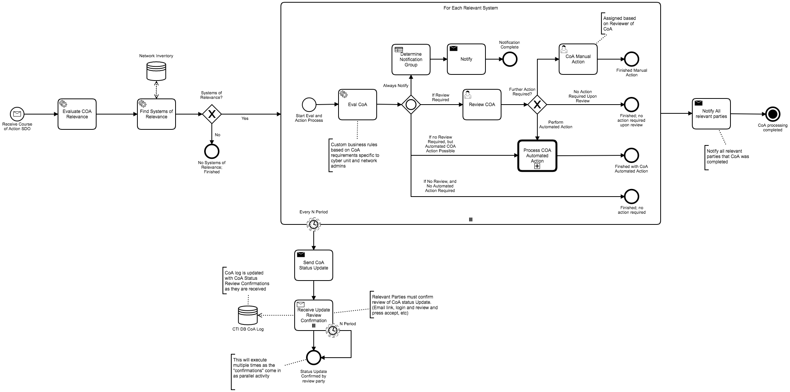
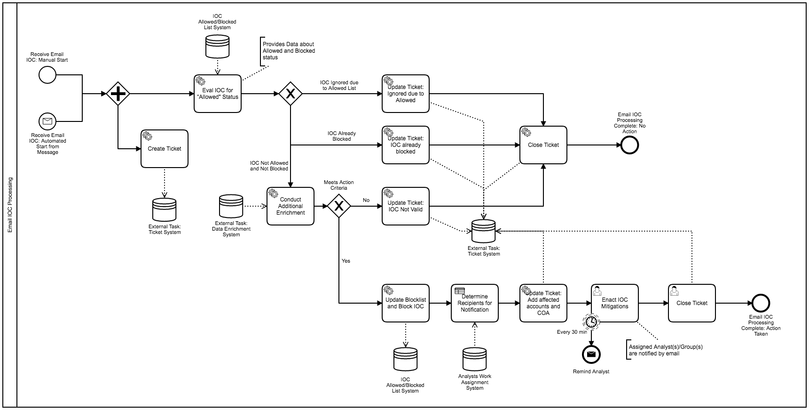
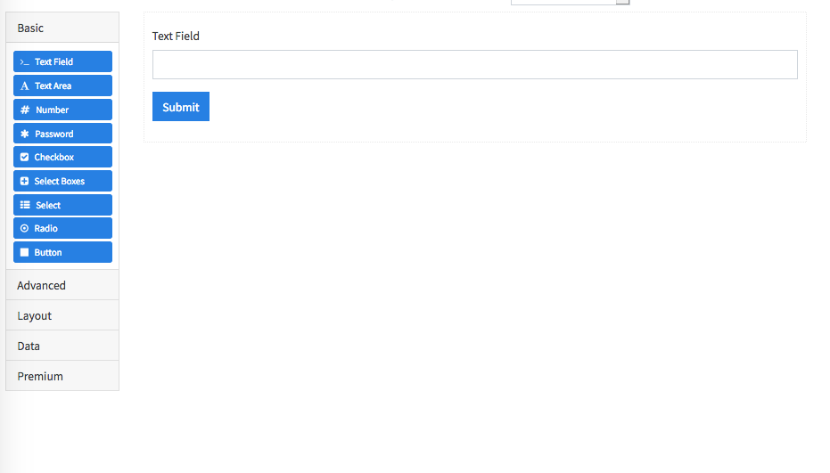
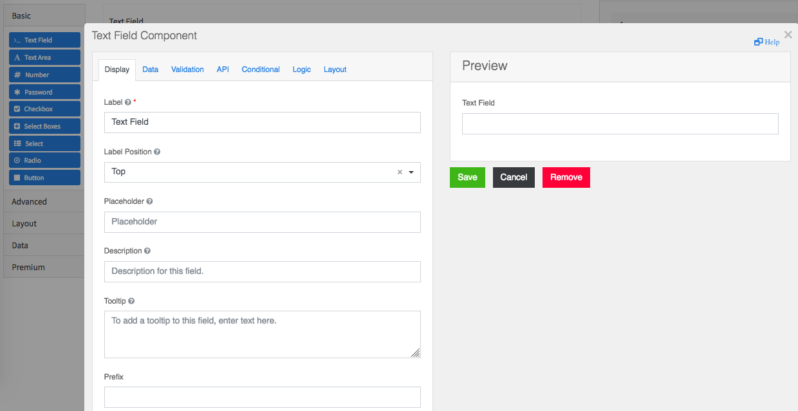
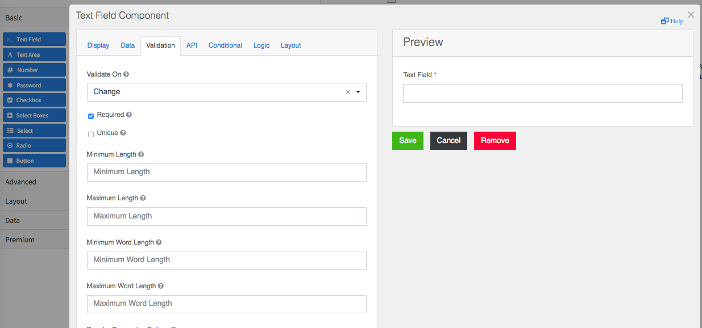

# SimpleSOAR

SOAR is an emerging market of cyber tools and platforms with lots of promises to automate cyber security tasks and incident responses.

If you remove all of the slick cyber-graphics and AI/ML/intel-feed/analytics buzzwords, a SOAR's core purpose is to provide orchestration capabilities, and where possible, have those orchestrations implement automation.

<strong>SimpleSOAR</strong> provides the tools to 

1. create cyber <strong>workflow orchestration</strong> at laptop and distributed global <strong>scale</strong>, 
1. implement <strong>playbook automation</strong> in any language (<strong>python</strong>, javascript, java, php, sql, C, dotNet, etc), 
1. execute automation on any network, system and device, 
1. <strong>easily interact with existing and future cyber-stacks</strong>, 
1. support <strong>manual human actions</strong>, and 
1. <strong>report and monitor</strong> orchestrations and playbook executions.

Organizations need ways to work with the myriad of products and services, including the in-house tools they develop, and not be locked into a vertical proprietary cyber-stack.  Organizations are dealing with, on average, 50+ cyber platforms, systems and one-trick cyber applications with names and acronyms like: SIEM, TIP, Threat-Intelligence, Cyber AI and ML, AI backed AV, IDPS, Security-Analytics, and the list goes on and on.  Orchestration tooling should enable enables sharing using common standards and practices used for business automation.  Organizations are adding and removing products and services as the organization grows and the threats evolve, and they should be able to maintain a consistent cyber orchestration capability that meets security and business needs.

## Usage Design

SimpleSOAR is designed to use a no-single-point-of-failure orchestrator using the Business Process Model and Notation (BPMN), an [ISO standard](https://www.iso.org/standard/62652.html).

BPMN based Workflows are created that represent the steps/actions/response you wish to take for a particular event or many different events.

BPMN enables a common language between cyber analyst and business to create common understanding of the overall orchestration, automation, manual actions, and overall response that will occur for an organization's response to cyber incidents.

The following are some examples of using [STIX](https://oasis-open.github.io/cti-documentation/) with BPMN for creating workflows that action automation based on the received STIX object:

The following is a example of a Email Indicator of Compromise and how a BPMN is used to generate a workflow that actions a response to the receipt of this IOC:

You can quickly build some sample BPMNs using the BPMN.io tool: https://demo.bpmn.io/new

## Task Execution

When a Workflow/BPMN is created for a cyber orchestration/automation, the tasks in the workflow are:

1. Performing a Action (Automated or Manual)
1. Sending a Message
1. Receiving or Waiting for a Message
1. Waiting for a period of time (Timer)
1. Making a decision on what the next action should be (Gateway)

When performing a automated action, these actions are performed by "Workers".

### Workers

Workers are microservices that can be written in any language that perform the actions defined by in workflow and orchestrated by the Orchestrator.

SimpleSOAR currently provides two workers:

1. User Task Worker
1. Python Executor Worker

### User Task Worker

The User Task Worker enables the creation of User Tasks / Manual Actions in a BPMN.  User Tasks are defined in the BPMN, and support actions like: assign, claim, unclaim, delete, candidate groups, and candidate groups.

A highlight of some of the properties available are:

1. Title
1. Description
1. Priority
1. Assignee (the current assignee of the task)
1. Candidate Groups (List of groups that if a user is a member of, they can claim this task / make themselves the assignee)
1. Candidate Users (list of users that if the user is in the list, they can claim this task / make themselves the assignee)
1. Due Date
1. Form Key (The name of the form that should be used to complete this task)

#### Forms

The User Tasks Worker has a unique feature: Forms

Forms enable you to define a Form Schema that is validated against when submitting data to complete a user task.

Forms can be created using the drag and drop form builder:

You can quickly try out the form builder with: https://formio.github.io/formio.js/app/builder

Form Schemas are saved into the User Tasks DB as a Form/FormSchema Entity and enable you to configure a User Task in the BPMN with a "formKey" value that maps to the form key of the Form Schema.

The Form system provides two components: Form Renderer and Form Validator Service.

The Form Render enables you to render the form on any browser and device.  Full look and feel customizations are possible.  Any rules build into the form that are possible to be validated on the client/renderer-side will occur in the browser

The Form Validator Service enables the forms to be re-validated server-side to ensure that the form submission contains what the form schema allows.

When completing a User Task, you submit data that is from the form.  The Form Render will validate and submit to the server, the server will revalidate and ensure compliance with the Form Schema.

Forms can also be used to impose system-to-system data schema restrictions.

### Python Executor Worker

The Python Executor Worker provides a flexible and robust Python script execution capability, where you can define a set of scripts that can be called by a Workflow, and the worker will execute these scripts and return the result to the Orchestrator.

The Worker will generate a temporary space for the execution of the script, where the Python script can read the variables from the Orchestrator, allowing json data to be sent to script, and the script can write a response json file, which the Worker will send back to the orchestrator as completion variables for the task.

The current Python Executor Worker has full permissions and capabilities, and should be considered a root execution.  The designed purpose of this worker is to perform any action a cyber analyst wishes to perform without limitations or restrictions.

The worker can be configured to use specific versions of Python, be provided with a list of packages to make available to script executions, and set maximum execution durations.

If a script execution results in a error, the Worker will capture the error information and report a failed execution back to the Orchestrator.  Depending on configuration, the Orchestrator may retry the execution or create a Orchestrator Incident for an analyst to investigate and resolve.

